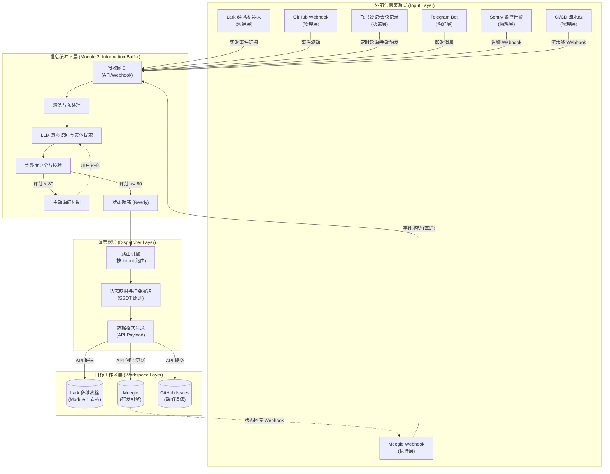

# XPBET AI Management 项目看板信息来源接入规划方案

**作者**: Manus AI (architect)
**日期**: 2026-04-08
**任务**: tsk-41c824dc-a53
**前序调研**: tsk-2beb54e9-462（项目看板信息来源全景调研）

---

## 1. 背景与目标

在《AI Management 看板系统优化与信息源架构设计方案》和前序调研任务（tsk-2beb54e9-462）的基础上，本方案旨在将调研结论转化为可落地的接入规划，并将其深度整合进现有的 AI Management 项目看板体系（Module 1）与信息缓冲区（Module 2）中。

前序调研报告（info_source_research.md）已系统性梳理了 10 种可行信息来源，并给出了"Lark群聊/Telegram（沟通层） + 会议转录（决策层） + Meegle（执行层） + GitHub/Sentry（物理层）"的立体信息源矩阵建议。本方案以此为基础，设计完整的接入架构、实施路径与技术规格。

**核心目标**：打破信息孤岛，实现项目看板数据的自动化更新与智能聚合，减少项目经理（PM）的人工录入负担。

---

## 2. 信息来源接入全景架构

系统采用"多源采集 → 统一缓冲 → 智能路由 → 看板渲染"的端到端架构。各信息来源通过不同的触发机制进入信息缓冲区（Buffer），经过 LLM 的意图识别、实体提取与完整度评分后，状态变更为 `ready` 的信息条目将被调度器（Dispatcher）推送至 Lark 看板或 Meegle 工作区。

### 2.1 架构数据流图 (Mermaid)

### 2.2 架构分层说明

系统整体分为四个核心层级，每层职责清晰、边界明确：

| 层级 | 核心职责 | 关键组件 |
| :--- | :--- | :--- |
| **入口层** (Input Layer) | 多渠道信息接收，统一推送至缓冲区网关 | Lark Bot、Telegram Bot、GitHub Webhook、Meegle Webhook、Sentry Webhook |
| **缓冲层** (Buffer Layer) | 信息清洗、意图识别、完整度评分、状态管理 | LLM 引擎、状态机（pending/asking/ready）、主动询问机制 |
| **调度层** (Dispatcher Layer) | 路由决策、状态映射、格式转换、幂等性检查 | 路由引擎、SSOT 冲突解决器、API Payload 构建器 |
| **工作区层** (Workspace Layer) | 最终数据落地，提供可视化看板 | Lark 多维表格（Module 1）、Meegle、GitHub Issues |

---

## 3. 分阶段实施路线图

为确保系统平稳上线与快速验证，接入工作分为三个阶段推进，遵循"先结构化、后非结构化；先高置信度、后低置信度"的原则。

### 3.1 第一阶段：Quick Win（第 1-2 周）

**目标**：接入成本低、价值高的结构化或半结构化数据源，快速打通"来源 → 缓冲 → 看板"的完整闭环，验证系统可行性。

**重点渠道**：
*   **Meegle Webhook**：研发执行侧的核心系统，状态变更是看板数据最可靠的事实来源。Webhook 接入成本极低，且数据结构化程度高，无需复杂的 LLM 解析，可直接驱动看板状态更新。
*   **Telegram/Lark Bot 直接指令**：PM 主动发送的结构化指令（如"新增功能：支付系统-微信支付"），信息意图明确，完整度评分通常较高，是快速验证缓冲区状态机的最佳场景。
*   **GitHub Actions CI/CD Webhook**：在 GitHub Actions 中增加 Webhook 步骤，将构建/部署结果推送至缓冲区，实现"已部署"状态的自动触发。

**预期成果**：Meegle 状态变更能自动同步至 Lark 看板；PM 通过 Telegram/Lark 发送的指令能自动创建看板记录。

### 3.2 第二阶段：核心建设（第 3-4 周）

**目标**：接入高频沟通场景，引入 LLM 智能拆分与归因能力，覆盖更广泛的信息来源。

**重点渠道**：
*   **Lark 群聊监控**：部署驻留机器人，实时抓取项目核心群的讨论，通过 LLM 识别多对话流，提取 Bug 报告、需求变更或进度阻塞。这是信息量最大、价值最高的沟通层来源。
*   **GitHub Webhook（Issues/PRs）**：接入代码提交与 Issue 状态，辅助验证 Meegle 研发进度，提供代码层面的事实依据。
*   **Sentry 生产监控告警**：将严重生产告警转化为高优先级缺陷报告，打破运维与项目管理之间的信息壁垒。

**预期成果**：群聊中的关键信息能自动提取并进入看板；生产告警能自动创建缺陷记录。

### 3.3 第三阶段：长期规划（第 5-8 周）

**目标**：接入高复杂度但高价值的多模态数据源，实现深度的项目洞察与里程碑预警。

**重点渠道**：
*   **飞书妙记/音视频会议记录**：通过 API 拉取会议转录文本，自动提取 Action Items，并与当前 PRD/看板状态进行交叉验证。这是决策层信息的核心来源，但处理复杂度最高。
*   **Lark 审批流与结构化表单**：接入需求申请、发布审批等结构化流程，将审批结果自动同步至看板。
*   **全局数据聚合与里程碑预警**：基于所有来源数据，构建"大版本 → 模块 → 里程碑 → 任务"的四级追踪体系，自动推演延期风险并在看板上以红色预警显示。

**预期成果**：会议 Action Items 能自动进入看板待确认队列；里程碑延期风险能提前预警。

---

## 4. Top 5 信息来源接入规格

针对优先级最高的五种信息来源，以下提供详细的接入规格。

### 4.1 来源一：Meegle 工作项状态变更（优先级 P0）

作为研发状态的 **Single Source of Truth**，其变更直接反映项目进度，是整个系统最核心的数据驱动力。

**触发机制**：事件驱动（Meegle Webhook）。监听 `story.updated`、`defect.updated`、`task.updated` 事件，当工作项状态发生变更时，Meegle 主动推送 Payload 至系统接收网关。

**数据字段映射表**：

| Meegle 原始字段 | 映射看板字段（Lark / kanban_data.json） | 转换规则 |
| :--- | :--- | :--- |
| `work_item_id` | `Meegle ID` | 直接映射 |
| `work_item_type` | （路由决策） | story → 功能；defect → Bug |
| `status.name` | `状态` | `In Progress` → 开发中；`In Testing` → 测试中；`Done` → 已上线 |
| `assignee.key` | `负责人` | 需通过全局人员映射表（Meegle Key → Lark User ID）转换 |
| `updated_at` | `更新时间` | ISO 8601 时间戳格式化 |
| `title` | `功能名称`（辅助匹配） | 用于在 Lark 看板中定位对应记录 |

**完整度评分规则**：系统级 Webhook 数据结构化程度极高，默认评分 **100 分**，直接标记为 `ready`，跳过 LLM 分析环节，大幅降低处理延迟。

**异常处理与降级策略**：若 `Meegle ID` 在 Lark 看板中未找到对应记录（即该工作项尚未在看板中登记），则将信息条目降级为 `pending` 状态，生成一条异常报告，通过 Lark Bot 提示 PM 手动关联。

---

### 4.2 来源二：Lark 群聊/机器人（优先级 P0）

项目沟通的主阵地，包含大量隐性知识与临时决策，是信息量最大的非结构化来源。

**触发机制**：实时事件推送（Lark 开放平台事件订阅 `im.message.receive_v1`）。机器人驻留于核心项目群，监听所有文本消息；同时支持 `@AI秘书` 或特定前缀（如 `#记录`）触发高强度 LLM 分析，以降低成本。

**数据字段映射表**（经 LLM 解析后）：

| LLM 提取字段 | 映射看板字段 | 说明 |
| :--- | :--- | :--- |
| `module_name` | `所属模块` | 模糊匹配模块表中的模块名称 |
| `feature_name` | `功能名称` | 精确匹配或创建新功能记录 |
| `intent_type` | （内部路由使用） | `bug_report` / `feature_request` / `progress_update` |
| `priority` | `功能优先级` | 高/中/低 → P0/P1/P2 |
| `assignee` | `负责人` | 提取 @ 提及的用户 |

**完整度评分规则**：
*   基础分 40 分（识别出明确意图与基本描述）
*   模块/功能匹配成功 +30 分
*   关键要素完整（责任人 +15，时间/优先级 +15）

**异常处理与降级策略**：评分 < 80 时，机器人直接在群内 @ 发送者进行追问（如："请问这个 Bug 属于哪个模块？优先级如何？"）。若 24 小时未回复，降级存入"待认领池"，由 PM 在每日汇总中统一处理。

---

### 4.3 来源三：Telegram Bot（优先级 P1）

PM 碎片化想法与备忘的快捷入口，主要处理移动端非正式场景的信息录入。

**触发机制**：即时消息（Telegram Bot API Webhook，`setWebhook` 模式）。Bot 监听私聊及指定群组消息。

**数据字段映射表**：与 Lark 群聊相同（经 LLM 解析），字段映射规则保持一致，共用同一套意图识别 Prompt。

**完整度评分规则**：与 Lark 群聊相同，基础分 40 + 模块匹配 30 + 关键要素 30。

**异常处理与降级策略**：通过 Telegram 对话框即时追问，支持多轮对话补充信息。若 PM 发送 `/cancel`，则将该条目标记为 `discarded`。

---

### 4.4 来源四：GitHub Webhook（优先级 P1）

代码层面的事实依据，用于辅助验证 Meegle 状态，并提供"已合并/已部署"的物理证明。

**触发机制**：事件驱动（GitHub Webhook）。监听以下事件：
*   `pull_request.closed`（merged: true）：代码合并，触发看板状态推进
*   `issues.opened`：新 Bug 报告
*   `issues.closed`：Bug 修复确认
*   `workflow_run.completed`（CI/CD）：部署成功

**数据字段映射表**：

| GitHub 原始字段 | 映射看板字段 / 动作 | 转换规则 |
| :--- | :--- | :--- |
| `pull_request.title` | `功能名称`（辅助匹配） | 模糊匹配看板功能记录 |
| `pull_request.body` | （关联 ID 提取） | 解析 `Fixes #123` 或 `Meegle-ID: xxx` 格式 |
| `issue.title` | `功能名称`（参考） | 辅助匹配或新建 Bug 记录 |
| `workflow_run.conclusion` | `状态` | `success` → 测试中（如部署到 staging） |

**完整度评分规则**：默认 90 分。若 PR 描述缺乏关联 ID（无法匹配任何功能模块），评分降至 50 分，需人工确认。

**异常处理与降级策略**：若无法关联任何功能模块，作为"未归属代码变更"记录在对应模块的 `备注` 字段中，并通过 Lark Bot 通知 PM。

---

### 4.5 来源五：飞书妙记/会议记录（优先级 P2）

高密度信息源，是项目决策与 Action Items 的核心来源，但处理复杂度最高。

**触发机制**：定时轮询（每日 18:00 通过飞书妙记 API 拉取当日新增会议记录）或 PM 手动触发（通过 Telegram/Lark Bot 发送 `/process_meeting [会议链接]`）。

**数据字段映射表**（经 LLM 解析 Action Items 后）：

| LLM 提取字段 | 映射看板字段 | 说明 |
| :--- | :--- | :--- |
| `action_item` | `功能名称` / `备注` | 作为新任务或现有任务的补充说明 |
| `owner` | `负责人` | 映射飞书用户 ID |
| `deadline` | `计划完成` | 提取时间实体（如"下周五"→具体日期） |
| `module_context` | `所属模块` | 从会议上下文中推断所属模块 |

**完整度评分规则**：
*   明确的动作描述 +40 分
*   明确的责任人 +30 分
*   明确的时间点 +30 分

**异常处理与降级策略**：由于会议记录可能存在大量上下文缺失，所有从会议记录提取的条目默认进入"待确认"队列（不自动更新看板），需 PM 在每日汇总卡片中一键确认或驳回，确保数据准确性。

---

## 5. 与现有模块的集成方案

本方案是对现有 Module 1（看板）和 Module 2（缓冲区）的深度融合，同时与 Meegle 实现双向联动。

### 5.1 与 Module 2（信息缓冲区）的集成

所有信息来源（Meegle Webhook 可选择直通）必须先进入缓冲区，通过统一的 `POST /buffer/items` 接口接收数据，`source_type` 字段用于标识来源渠道。缓冲区的状态机（`pending` → `asking` → `ready`）负责控制信息流转，确保只有高质量的信息才能进入下游系统。各来源的 `source_type` 枚举值扩展如下：

| 信息来源 | `source_type` 值 |
| :--- | :--- |
| Lark 群聊 | `lark_group` |
| Telegram Bot | `telegram` |
| Meegle Webhook | `meegle_webhook` |
| GitHub Webhook | `github_webhook` |
| 飞书妙记 | `feishu_minutes` |
| Sentry 告警 | `sentry_alert` |
| CI/CD 流水线 | `cicd_pipeline` |

### 5.2 与 Module 1（Lark 看板）的集成

当缓冲区信息状态变为 `ready` 时，调度器调用 `feishu-bitable` 技能或 Lark 开放 API，根据 `parsed_intent` 执行以下操作：

*   `feature_request` → 在功能表中新增一行记录，状态为"待规划"
*   `progress_update` → 查找对应功能记录，更新 `状态` 字段
*   `bug_report` → 在功能表中新增 Bug 记录，或追加至现有记录的 `备注` 字段
*   `memo` → 在备忘视图中新增记录，并设置定时提醒

### 5.3 与 Meegle 的双向集成

Meegle 与 Lark 看板之间的双向同步遵循 **Single Source of Truth（SSOT）** 原则：

*   **Lark → Meegle（推送方向）**：当 Lark 看板中功能状态变更为"开发中"时，调度器调用 Meegle API 创建对应的 Story/Task，并将 Meegle 工作项 ID 回写至 Lark 的 `Meegle ID` 字段。
*   **Meegle → Lark（回传方向）**：当 Meegle 工作项状态变更时，通过 Webhook 回传至缓冲区，缓冲区直接将其标记为 `ready` 并更新 Lark 看板状态。
*   **冲突解决原则**：进入开发前（无 Meegle ID），以 Lark 为主；进入开发后（存在 Meegle ID），以 Meegle 为主。

---

## 6. 技术风险与应对措施

| 风险点 | 影响程度 | 发生概率 | 应对措施 |
| :--- | :--- | :--- | :--- |
| **LLM 幻觉与意图误判** | 高 | 中 | 强制完整度评分机制；关键状态变更（如"已上线"）依赖 Meegle/GitHub 事实数据而非 LLM 推断；优化 Prompt，提供丰富的项目上下文 Few-shot 示例。 |
| **多源数据并发冲突** | 中 | 中 | 引入分布式锁（如 Redis）或数据库乐观锁，确保同一 `Meegle ID` 或 `功能名称` 的更新操作串行执行；实现幂等性检查，防止重复写入。 |
| **身份映射失败** | 高 | 高 | 建立统一的"Lark ID - Meegle Key - GitHub ID - Telegram ID"映射数据库；若匹配失败，操作分配给默认"待分配"账号，并通过 Lark Bot 触发通知，要求 PM 手动关联。 |
| **群聊噪音过大** | 中 | 高 | 优化 Lark 机器人监听策略，仅在被 `@AI秘书` 或识别到特定前缀（如 `#记录`）时进行高强度 LLM 分析；其余消息仅做关键词检测，降低成本与误报率。 |
| **API 限流与延迟** | 低 | 中 | 实现重试机制与指数退避算法；将非实时性要求高的操作（如会议记录解析、日报生成）放入异步消息队列（如 Celery/Redis Queue）处理，避免阻塞主流程。 |
| **Webhook 安全性** | 高 | 低 | 对所有 Webhook 端点实施签名验证（如 GitHub 的 HMAC-SHA256、Lark 的 Token 验证）；使用 HTTPS 加密传输；限制 IP 白名单。 |
| **防堆积与信息过载** | 中 | 中 | 严格执行缓冲区防堆积策略：24 小时未处理降级，72 小时强制归档，同类信息超过 50 条时触发批量合并提示。 |
