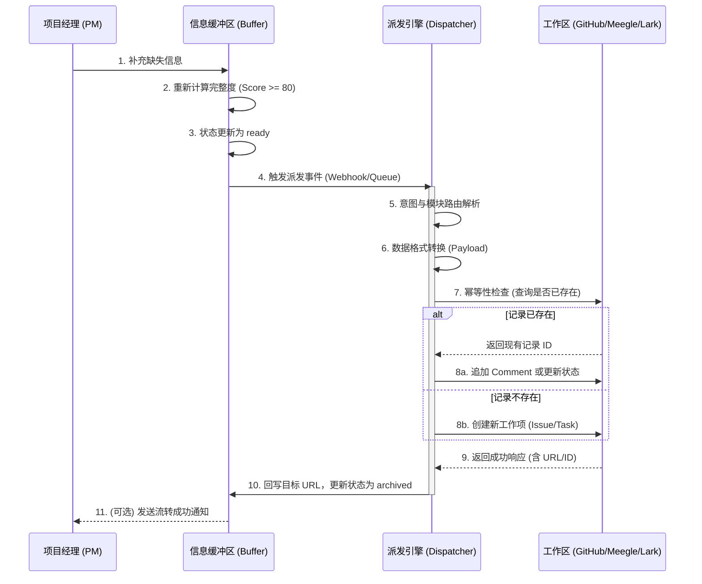

# 缓冲区到工作区的流转流程设计

## 1. 概述

**信息缓冲区 (Information Buffer)** 是处理非结构化、不完整信息的暂存区；而 **工作区 (Workspace)** 是项目团队实际执行任务、追踪进度和管理代码的系统（如 GitHub Issues、Meegle、Lark 多维表格）。

本设计定义了信息条目在达到“就绪 (`ready`)”状态后，如何准确、无缝地流转到工作区，并转化为可执行的工作项。

## 2. 状态映射与派发规则

当缓冲区中的条目状态变为 `ready`（完整度评分 ≥ 80）时，系统将根据其 `parsed_intent`（意图）和 `module_name`（模块）执行派发规则。

### 2.1 意图到工作项的映射 (Intent to Work Item Mapping)

| 缓冲区意图 (`parsed_intent`) | 目标工作区系统 | 目标工作项类型 | 关键字段映射规则 |
| :--- | :--- | :--- | :--- |
| **缺陷报告 (Bug Report)** | GitHub / Meegle | Issue (Bug) / Defect | `Title`: [Bug] + 核心描述 `Body`: 复现步骤、影响范围 `Labels`: `bug`, `module:{module_name}` |
| **需求/特性 (Feature Request)** | GitHub / Meegle | Issue (Enhancement) / Story | `Title`: [Feature] + 核心描述 `Body`: 业务价值、预期结果 `Labels`: `enhancement`, `module:{module_name}` |
| **进度更新 (Progress Update)** | GitHub | Issue Comment | 找到对应模块的 Epic/Issue，将内容作为 Comment 追加，并可能触发状态流转。 |
| **备忘 (Memo)** | Lark 多维表格 / GitHub | 备忘录记录 / Issue (Task) | `Title`: [Memo] + 核心描述 `Due Date`: 提取的时间实体 `Assignee`: 提取的人员 |
| **会议纪要 (Meeting Notes)** | Lark Wiki / GitHub | Wiki 页面 / Issue Comment | 将提取的 Action Items 分解为独立的 Task，纪要正文存入 Wiki 或对应 Issue。 |

### 2.2 模块路由规则 (Module Routing)

1.  **已明确模块**: 直接路由到该模块对应的 GitHub Repository 或 Meegle Project 中的特定 Epic/Label 下。
2.  **未明确模块 (全局/跨模块)**: 路由到项目的“全局 (Global)”或“基础设施 (Infrastructure)”板块，并打上 `needs-triage` 标签，等待人工二次分发。

## 3. 流转执行机制

流转过程由 AI 秘书的后台任务异步执行，确保不阻塞用户的交互。

1.  **数据转换 (Data Transformation)**: 将缓冲区 JSON 格式的 `extracted_entities` 转换为目标系统 API 所需的 Payload 格式（如 GitHub REST API 的 Issue 格式）。
2.  **幂等性检查 (Idempotency Check)**: 在目标系统创建记录前，检查是否已存在相同特征的记录（基于哈希值或特定标识），防止重复创建。
3.  **执行 API 调用 (API Execution)**: 调用 GitHub/Meegle/Lark 的 API 创建或更新记录。
4.  **状态回写 (State Write-back)**:
    *   **成功**: 将目标系统返回的 URL 或 ID（如 GitHub Issue #123）记录到缓冲区条目中，并将缓冲区条目状态更新为 `archived`。
    *   **失败**: 记录错误日志，触发重试机制（最多重试 3 次）。若最终失败，状态回退为 `ready`，并向 PM 发送异常通知。

## 4. 流转流程图 (Mermaid)

