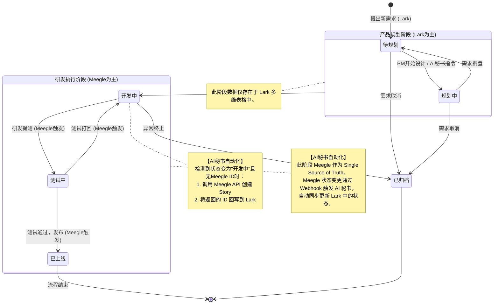

# 核心模块1：状态流转图

本图展示了产品功能在 Lark 多维表格和 Meegle 之间的状态流转过程，以及 AI 秘书在其中扮演的自动化角色。

```mermaid
stateDiagram-v2
    [*] --> 待规划: 提出新需求 (Lark)
    
    state "产品规划阶段 (Lark为主)" as ProductPhase {
        待规划 --> 规划中: PM开始设计 / AI秘书指令
        规划中 --> 待规划: 需求搁置
    }
    
    ProductPhase --> 开发中: 确认排期，进入开发
    
    state "研发执行阶段 (Meegle为主)" as DevPhase {
        开发中 --> 测试中: 研发提测 (Meegle触发)
        测试中 --> 开发中: 测试打回 (Meegle触发)
        测试中 --> 已上线: 测试通过，发布 (Meegle触发)
    }
    
    已上线 --> [*]: 流程结束
    
    待规划 --> 已归档: 需求取消
    规划中 --> 已归档: 需求取消
    开发中 --> 已归档: 异常终止
    
    已归档 --> [*]

    %% 自动化动作标注
    note right of ProductPhase
        此阶段数据仅存在于 Lark 多维表格中。
    end note
    
    note right of 开发中
        【AI秘书自动化】
        检测到状态变为"开发中"且无Meegle ID时：
        1. 调用 Meegle API 创建 Story
        2. 将返回的 ID 回写到 Lark
    end note
    
    note right of DevPhase
        【AI秘书自动化】
        此阶段 Meegle 作为 Single Source of Truth。
        Meegle 状态变更通过 Webhook 触发 AI 秘书，
        自动同步更新 Lark 中的状态。
    end note
```
