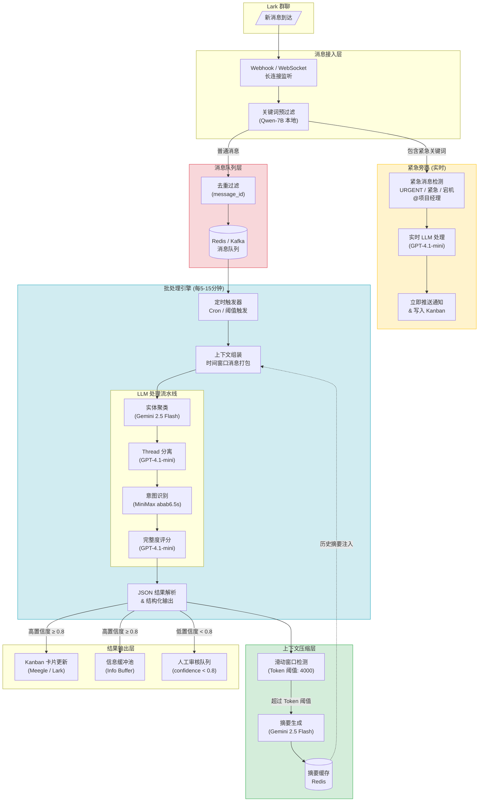

# AI Token 成本优化与批处理架构方案

**作者**: Manus AI  
**日期**: 2026-04-09  
**所属模块**: 模块一 (看板系统)

---

## 1. 背景与目标

在当前 Module1 (Lark 群聊监控 + Thread Separation) 的实现中，采用了实时 Webhook 触发 LLM 调用的方式。虽然保证了极高的实时性，但在团队沟通高峰期（如 5 分钟内产生 100+ 条群聊消息），频繁唤醒 LLM 处理细碎消息会导致极高的 Token 成本，并带来不必要的 API 限流风险。

为了解决高频 Webhook 触发带来的 Token 浪费，本方案旨在设计一套**分层模型选型策略**与**消息队列周期性批处理架构**，在保证关键信息不遗漏的前提下，最大化降低大模型推理成本。

---

## 2. 分层模型选型策略

群聊信息的处理链路可拆分为 5 个复杂度递增的阶段。根据每个阶段对逻辑推理和语义理解的不同要求，我们为其匹配了最具性价比的模型，并对比了 GPT-4.1-mini [1]、MiniMax abab6.5s [2]、Gemini 2.5 Flash [3] 以及本地轻量模型（Qwen2.5-7B-Instruct）[4]。

### 2.1 阶段选型与成本估算矩阵

假设每条群聊消息平均包含 200 Tokens 的上下文，以下为各阶段处理每 1000 条消息的 Token 成本估算：

| 处理阶段 | 任务特征 | 推荐模型 | 每百万 Token 价格 (Input / Output) | 每千条消息成本估算 (USD) |
| :--- | :--- | :--- | :--- | :--- |
| **1. 关键词过滤** | 简单匹配，规则与正则判断 | 本地轻量模型 (Qwen2.5-7B) | 免费 (本地算力部署) | $0.00 |
| **2. 实体聚类** | 信息抽取，短文本理解 | Gemini 2.5 Flash | $0.075 / $0.30 | $0.015 |
| **3. Thread分离** | 复杂上下文理解，逻辑推理 | GPT-4.1-mini | $0.15 / $0.60 | $0.03 |
| **4. 意图识别** | 语义分类，少样本学习 | MiniMax abab6.5s | $0.14 / $0.14 (约合 1 RMB) | $0.028 |
| **5. 完整度评分** | 深度推理，多维评估与总结 | GPT-4.1-mini | $0.15 / $0.60 | $0.03 |

> **选型说明**: 
> * **Qwen2.5-7B**: 作为前置网关，负责无脑拦截无意义的表情包、纯打招呼消息，利用本地算力实现零成本过滤。
> * **Gemini 2.5 Flash**: 凭借其超大上下文窗口和极低的 Input 成本，非常适合对海量文本进行初步的实体抽取。
> * **GPT-4.1-mini**: 在处理复杂的多对话交织（Thread Separation）和最终的逻辑评分时，其表现最为稳定。
> * **MiniMax abab6.5s**: 作为国内优秀的模型，其 API 定价极具竞争力，且在中文意图分类上表现优异。

---

## 3. 消息队列与周期性批处理架构

将“实时触发”改为“消息先进队列，周期性批处理”，是降低成本的核心。

### 3.1 架构设计原理

1. **消息接收层**: Webhook 接收 Lark 消息后，不立即触发 LLM，而是经过 Qwen-7B 预过滤后推入 Redis / Kafka 消息队列。
2. **批处理触发器**: 定时任务（Cron）每 5-15 分钟触发一次，或者当队列中消息达到特定阈值（如 50 条）时触发。
3. **上下文组装**: 从队列中拉取同一时间窗口内的所有消息，按时间线组装成一个完整的 Prompt 上下文。
4. **LLM 批量处理**: 调用大模型一次性完成该时间窗口内的 Thread 分离、意图识别和实体提取，极大地摊薄了 System Prompt 的固定消耗。

### 3.2 完整架构图

以下为批处理架构的完整 Mermaid 流程图：



### 3.3 批处理 Prompt 模板

在批处理阶段，我们将多条消息打包发送给 LLM，要求其输出结构化的 JSON 数组：

```json
{
  "system_prompt": "你是一个群聊消息处理助手。请将以下时间窗口内的消息列表进行 Thread 分离、意图识别和实体提取。",
  "input_schema": {
    "type": "array",
    "items": {
      "type": "object",
      "properties": {
        "msg_id": {"type": "string", "description": "消息唯一标识"},
        "sender": {"type": "string", "description": "发送者"},
        "content": {"type": "string", "description": "消息内容"},
        "timestamp": {"type": "string", "description": "发送时间"}
      }
    }
  },
  "output_schema": {
    "type": "array",
    "items": {
      "type": "object",
      "properties": {
        "thread_id": {"type": "string", "description": "分离后的线程ID"},
        "intent": {"type": "string", "description": "该线程的核心意图 (如 bug_report, feature_request)"},
        "entities": {
          "type": "array",
          "items": {"type": "string"},
          "description": "提取的关键实体 (模块名、报错码等)"
        },
        "msg_ids": {
          "type": "array",
          "items": {"type": "string"},
          "description": "归属于该线程的消息ID列表"
        },
        "confidence": {"type": "number", "description": "分离与意图识别的置信度 (0.0-1.0)"}
      }
    }
  }
}
```

---

## 4. 紧急消息旁路机制

虽然批处理极大地降低了成本，但会引入 5-15 分钟的延迟。对于生产环境的紧急故障，这种延迟是不可接受的。因此，我们设计了**紧急消息旁路（Urgent Bypass）机制**。

1. **规则检测**: 在消息接入层，利用本地部署的 Qwen-7B 或简单的正则表达式，对每一条进入的消息进行快速扫描。
2. **触发条件**:
   * 消息体包含高危关键词（如：`URGENT`, `紧急`, `宕机`, `P0`, `502 Bad Gateway`）。
   * 消息中直接 `@项目经理` 或 `@OnCall` 轮值人员。
3. **实时处理**: 满足上述条件的消息将**跳过消息队列**，直接拉起一条独立的 GPT-4.1-mini 链路进行实时分析，并立即推送到相关人员的 Lark 或 Kanban 预警通道。

---

## 5. 上下文压缩策略 (滑动窗口摘要)

在长期运行的 Thread 中，历史消息的不断累积会导致单次 API 调用的 Token 消耗呈线性增长。为此，引入**滑动窗口摘要机制**进行上下文压缩：

1. **阈值设定**: 设定单次处理的 Token 阈值上限（例如 4000 Tokens）。
2. **触发摘要**: 当某个 Thread 的历史消息累积超过该阈值时，系统触发摘要任务。
3. **降本生成**: 调用成本极低的 Gemini 2.5 Flash，将前 N 条老消息压缩为一段精简的结构化摘要（Summary）。
4. **上下文替换**: 在后续的批处理调用中，使用 `[历史摘要] + [最近 M 条原始消息]` 的组合作为上下文，替代冗长的完整历史记录。摘要结果持久化存储于 Redis 中供随时读取。

---

## References

[1] OpenAI. "Pricing | OpenAI API". https://openai.com/api/pricing/  
[2] MiniMax. "Pay as You Go - MiniMax API Docs". https://platform.minimax.io/docs/guides/pricing-paygo  
[3] Google. "Gemini Developer API pricing". https://ai.google.dev/gemini-api/docs/pricing  
[4] Alibaba Cloud. "Alibaba Cloud Model Studio model pricing". https://www.alibabacloud.com/help/en/model-studio/model-pricing
