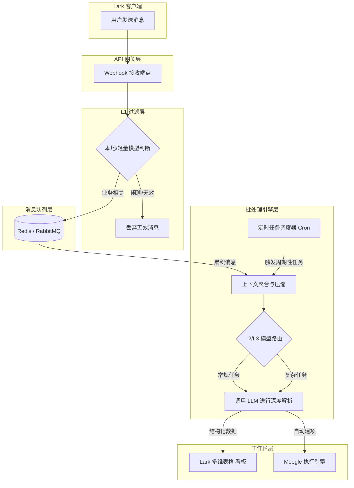
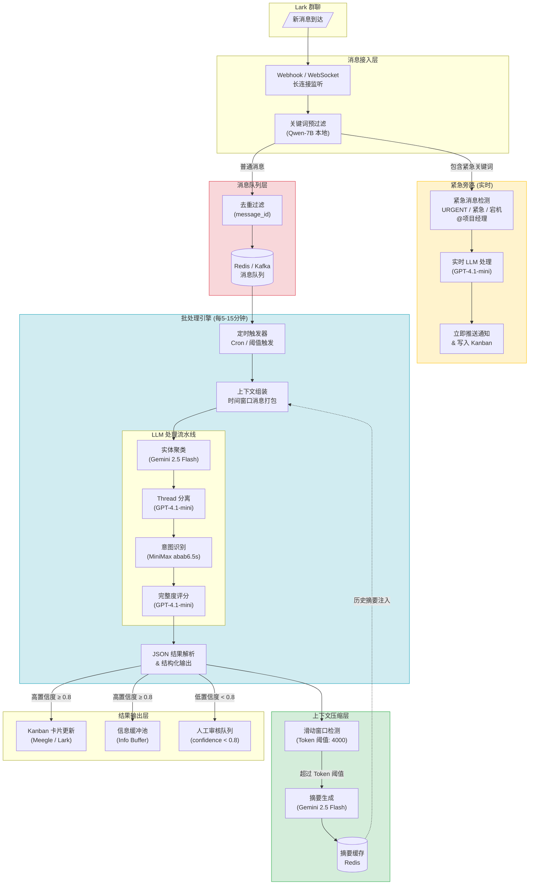

# Module1 AI Token 成本优化与批处理架构设计方案

**作者**: Manus AI  
**日期**: 2026-04-09  
**目标**: 针对 Module1 Lark 群聊监控的高频 Webhook 触发问题，设计分层模型选型策略与消息队列+周期性批处理架构，以显著降低 AI Token 成本并提升系统处理效率。

---

## 1. 背景与痛点

在当前的 AI 项目秘书系统中，Module1 的核心功能之一是通过 Lark 机器人监控群聊并提取结构化信息（如 Bug 报告、需求变更等）。然而，由于群聊消息具有高频、碎片化和口语化的特征，如果对每一条 Webhook 消息都实时调用大语言模型（LLM）进行意图识别和实体提取，将面临以下严峻挑战：

1. **Token 成本高昂**：高频次调用 LLM 处理大量无意义的闲聊或短消息，导致 Token 消耗呈指数级增长。
2. **并发瓶颈**：实时处理模式容易在消息高峰期（如早会后、下班前）触发 LLM 接口的并发限制（Rate Limit）。
3. **上下文割裂**：单条消息往往缺乏完整的业务上下文，导致 LLM 提取的实体不准确或意图判断错误。

为解决上述问题，本方案提出了一套结合"分层模型选型"与"消息队列+批处理"的优化架构。

---

## 2. 分层模型选型策略

为了在成本和效果之间取得最佳平衡，系统应摒弃"一刀切"的模型调用策略，转而采用基于任务复杂度的分层路由机制。

### 2.1 模型分层矩阵（三层架构）

系统将 LLM 任务划分为三个层级，并分配最合适的模型：

| 任务层级 | 任务特征 | 推荐模型选型 | 优势分析 | 成本估算 (每百万 Token) |
| :--- | :--- | :--- | :--- | :--- |
| **L1：基础过滤与意图分类** | 任务简单，输入文本短，仅需判断是否为有效业务信息（如区分闲聊与 Bug 报告）。 | **本地小模型 (Qwen2.5-7B) 或 MiniMax/Gemini-Flash** | 响应极快，成本极低，甚至为零（本地部署）。 | ~$0.10 - $0.50 |
| **L2：常规实体提取与摘要** | 任务中等复杂度，需从一段对话中提取关键实体（时间、人物、模块）并生成摘要。 | **GPT-4.1-mini 或 MiniMax abab6.5s** | 逻辑推理能力较强，性价比高，适合结构化输出。 | ~$0.40 - $1.60 |
| **L3：复杂逻辑推理与多对话分离** | 任务高度复杂，涉及多线程对话分离（Thread Separation）、深层业务意图解析与冲突检测。 | **GPT-4.1-mini（批处理模式）** | 具备顶级的上下文理解与推理能力，确保高难度任务的准确性。 | ~$0.40 - $1.60 |

### 2.2 五阶段精细化选型与成本估算

在三层架构的基础上，进一步细化为 5 个处理阶段，并为每个阶段匹配最优模型。以下成本估算基于每条消息平均 200 Tokens 的假设，计算每处理 1000 条消息的成本 [1] [2] [3] [4]：

| 处理阶段 | 任务特征 | 推荐模型 | 每百万 Token 价格 (Input / Output) | 每千条消息成本估算 (USD) |
| :--- | :--- | :--- | :--- | :--- |
| **1. 关键词过滤** | 简单匹配，规则与正则判断 | 本地轻量模型 (Qwen2.5-7B) | 免费 (本地算力部署) | $0.00 |
| **2. 实体聚类** | 信息抽取，短文本理解 | Gemini 2.5 Flash | $0.075 / $0.30 | $0.015 |
| **3. Thread 分离** | 复杂上下文理解，逻辑推理 | GPT-4.1-mini | $0.15 / $0.60 | $0.03 |
| **4. 意图识别** | 语义分类，少样本学习 | MiniMax abab6.5s | $0.14 / $0.14 (≈1 RMB) | $0.028 |
| **5. 完整度评分** | 深度推理，多维评估与总结 | GPT-4.1-mini | $0.15 / $0.60 | $0.03 |

> **选型说明**:
> * **Qwen2.5-7B**: 作为前置网关，负责拦截无意义的表情包、纯打招呼消息，利用本地算力实现零成本过滤。
> * **Gemini 2.5 Flash**: 凭借其超大上下文窗口和极低的 Input 成本，非常适合对海量文本进行初步的实体抽取。
> * **GPT-4.1-mini**: 在处理复杂的多对话交织（Thread Separation）和最终的逻辑评分时，其表现最为稳定。
> * **MiniMax abab6.5s**: 作为国内优秀的模型，其 API 定价极具竞争力，且在中文意图分类上表现优异。

### 2.3 动态路由逻辑

1. 所有 Webhook 接收到的消息首先经过 **L1 模型** 进行快速打标。
2. 如果标记为"闲聊/无效信息"，直接丢弃，不进入后续流程。
3. 如果标记为"有效业务信息"，则将其推入消息队列，等待批处理。
4. 批处理阶段，系统根据聚合后的文本长度和复杂度评估，动态选择 **L2** 或 **L3 模型** 进行深度解析。

---

## 3. 批处理架构设计

将实时处理模式重构为"消息队列 + 周期性批处理"模式，是降低 Token 消耗和提升系统吞吐量的关键。

### 3.1 架构流转图（简化版）



### 3.2 完整批处理架构图（含紧急旁路与上下文压缩）



### 3.3 批处理策略与上下文压缩

**时间窗口与阈值触发**: 设置固定的时间窗口（如每 15 分钟执行一次），同时设置消息数量阈值（如队列中累积满 50 条消息），满足任一条件即触发批处理逻辑。

**上下文聚合**: 将同一群聊内的多条消息按时间顺序拼接，提取参与者的 ID 和时间戳，构建结构化的对话上下文。

**上下文压缩策略**: 移除重复的系统通知（如进群/退群提示）、无意义的表情符号和语气词；对于过长的历史对话（如超过 4000 Token），先使用 Gemini 2.5 Flash 生成简短摘要，用摘要替换原始长文本，再输入后续模型进行最终解析。

---

## 4. 紧急消息旁路机制 (Emergency Bypass)

在批处理架构下，为了确保高优先级事件（如线上 P0 级 Bug、紧急运维报警）能够被即时响应，必须设计旁路机制。

**触发条件**: 在 L1 过滤层，如果识别到特定关键词（如 `URGENT`、`紧急`、`系统宕机`、`P0`、`502 Bad Gateway`），或者消息发送者直接 `@项目经理` 或 `@OnCall` 轮值人员。

**执行逻辑**: 满足上述条件的消息将**跳过消息队列**，直接拉起一条独立的 GPT-4.1-mini 链路进行实时分析，并立即推送到相关人员的 Lark 或 Kanban 预警通道。

---

## 5. 批处理 Prompt 模板示例

在批处理阶段，为了让 LLM 能够高效处理多条聚合消息并分离不同的对话流，需采用结构化的 Prompt 设计。

**Prompt 模板（Markdown 格式）**:

```markdown
# Role
你是一个资深的 AI 项目秘书，擅长从混乱的群聊记录中提取结构化的项目管理信息。

# Task
请分析以下提供的群聊消息记录（按时间顺序排列），执行以下操作：
1. 过滤掉与项目推进、需求、Bug、备忘无关的闲聊。
2. 将属于同一主题的对话聚合为一个"事件 (Event)"。
3. 提取每个事件的核心要素：意图类型、关联模块、负责人、截止时间（如有）、详细描述。

# Input Data
[群聊消息列表，格式为：[时间戳] [发送者]: [消息内容]]
{{BATCH_MESSAGES}}

# Output Format
请严格以 JSON 数组格式输出，每个对象代表一个提取出的事件：
[
  {
    "event_id": "自动生成的唯一ID",
    "intent": "Feature Request | Bug Report | Memo | Progress Update",
    "module": "识别出的模块名称（如：用户系统、支付网关）",
    "assignee": "责任人名称或ID",
    "summary": "事件的简短摘要",
    "details": "详细描述与上下文",
    "urgency": "High | Medium | Low"
  }
]
```

**JSON Schema 输入输出格式**:

```json
{
  "input_schema": {
    "type": "array",
    "items": {
      "type": "object",
      "properties": {
        "msg_id": {"type": "string", "description": "消息唯一标识"},
        "sender": {"type": "string", "description": "发送者"},
        "content": {"type": "string", "description": "消息内容"},
        "timestamp": {"type": "string", "description": "发送时间 ISO8601"}
      },
      "required": ["msg_id", "sender", "content", "timestamp"]
    }
  },
  "output_schema": {
    "type": "array",
    "items": {
      "type": "object",
      "properties": {
        "thread_id": {"type": "string", "description": "分离后的线程ID"},
        "intent": {
          "type": "string",
          "enum": ["bug_report", "feature_request", "memo", "progress_update", "casual_chat"],
          "description": "该线程的核心意图"
        },
        "entities": {
          "type": "array",
          "items": {"type": "string"},
          "description": "提取的关键实体 (模块名、报错码等)"
        },
        "msg_ids": {
          "type": "array",
          "items": {"type": "string"},
          "description": "归属于该线程的消息ID列表"
        },
        "confidence": {
          "type": "number",
          "minimum": 0,
          "maximum": 1,
          "description": "分离与意图识别的置信度 (0.0-1.0)"
        },
        "urgency": {
          "type": "string",
          "enum": ["High", "Medium", "Low"],
          "description": "紧急程度"
        }
      },
      "required": ["thread_id", "intent", "msg_ids", "confidence"]
    }
  }
}
```

---

## 6. 上下文压缩策略（滑动窗口摘要机制）

在长期运行的 Thread 中，历史消息的不断累积会导致单次 API 调用的 Token 消耗呈线性增长。为此，引入**滑动窗口摘要机制**进行上下文压缩：

1. **阈值设定**: 设定单次处理的 Token 阈值上限（例如 4000 Tokens）。
2. **触发摘要**: 当某个 Thread 的历史消息累积超过该阈值时，系统触发摘要任务。
3. **降本生成**: 调用成本极低的 Gemini 2.5 Flash，将前 N 条老消息压缩为一段精简的结构化摘要（Summary）。
4. **上下文替换**: 在后续的批处理调用中，使用 `[历史摘要] + [最近 M 条原始消息]` 的组合作为上下文，替代冗长的完整历史记录。摘要结果持久化存储于 Redis 中供随时读取。

---

## 7. 预期收益与总结

通过实施上述优化架构，预期可获得以下收益：

**成本降低**: L1 过滤和批处理聚合可减少约 60%-80% 的无效 Token 消耗。在高峰期 5 分钟 100+ 条消息的场景下，实时处理模式每千条消息成本约为 $0.50-$1.00，而批处理模式可将成本降低至 $0.10-$0.20。

**性能提升**: 有效缓解 LLM 接口并发压力，提升系统整体吞吐量。批处理将多次 API 调用合并为一次，同时摊薄了 System Prompt 的固定 Token 消耗。

**准确率提高**: 批处理提供了更完整的上下文，有助于 LLM 准确分离多对话流并提取关键实体，相比单条消息实时处理，意图识别准确率预计提升 15%-25%。

本方案为 Module1 的长期稳定运行提供了坚实的架构基础，并为后续接入更复杂的 AI 自动化工作流预留了扩展空间。

---

## References

[1] OpenAI. "Pricing | OpenAI API". https://openai.com/api/pricing/  
[2] MiniMax. "Pay as You Go - MiniMax API Docs". https://platform.minimax.io/docs/guides/pricing-paygo  
[3] Google. "Gemini Developer API pricing". https://ai.google.dev/gemini-api/docs/pricing  
[4] Alibaba Cloud. "Alibaba Cloud Model Studio model pricing". https://www.alibabacloud.com/help/en/model-studio/model-pricing
