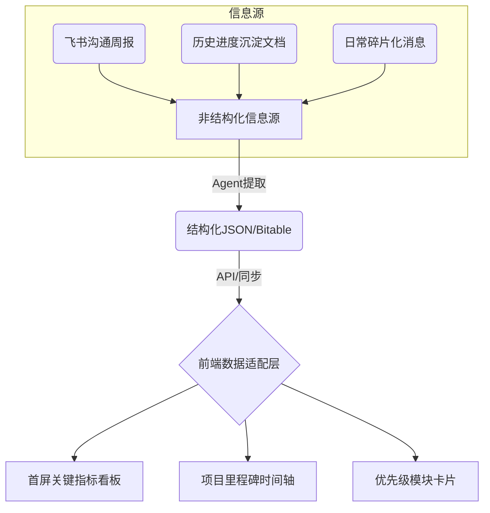

# 项目可视化看板数据链路与架构设计 (方案A)

## 1. 架构目标
构建一条从“非结构化沟通信息/历史沉淀文档”到“前端交互式可视化看板”的完整数据链路，实现项目进度、风险预警和核心KPI的自动化提取与可视化展示。

## 2. 整体数据链路 (Data Pipeline)



### 2.1 数据提取层 (Agent/Buffer)
- **输入**: 历史模块进度沉淀文档 (`xp_team_history_progress_report.md`)、飞书群组沟通周报 (`lark_group_weekly_report.md`) 等 Markdown 文本。
- **处理**: 借助大语言模型 (LLM) 进行实体抽取、意图识别与状态评估。
- **输出**: 强类型约束的结构化 JSON 数据或更新到飞书多维表格 (Bitable)。

### 2.2 数据存储与适配层
- 前端（如 `xpbet-frontend-components` 仓库）无法直接读取非结构化 Markdown，需要一个中间层提供固定格式的数据。
- **方案**: 
  1. 定时任务 (Cron Job) 运行脚本，将 Markdown 报告解析为 `dashboard_data.json` 并部署到静态资源服务器或 S3。
  2. 或直接通过 Lark Bitable API 实时读取数据。

### 2.3 前端渲染层 (Frontend Visualization)
根据设计偏好，前端呈现分为三大核心区域：首屏关键指标、项目整体里程碑、优先级模块卡片。

---

## 3. 核心数据结构设计 (JSON Schema)

为了满足前端可视化组件的需求，设计如下固定格式的 JSON 数据结构：

### 3.1 顶层结构
```json
{
  "last_updated": "2026-04-14T10:00:00Z",
  "project_name": "XP-BET & Sports-Matcher-Go",
  "kpi_metrics": {},
  "milestones": [],
  "modules": []
}
```

### 3.2 KPI 关键指标 (kpi_metrics)
用于首屏量化呈现，支持趋势图和波纹动效。
```json
"kpi_metrics": {
  "health_score": {
    "value": 85,
    "trend_7d": [78, 80, 82, 81, 84, 85, 85],
    "details": {"bug_rate": "low", "delay_rate": "medium"}
  },
  "risk_alerts": {
    "count": 3,
    "trend_7d": [1, 2, 1, 3, 2, 4, 3],
    "threshold": 5
  },
  "stage_version": {
    "current": "V1.2.0",
    "history": ["V1.0.0", "V1.1.0", "V1.1.5"]
  }
}
```

### 3.3 里程碑时间轴 (milestones)
项目整体里程碑时间轴，当前阶段居中。
```json
"milestones": [
  {
    "date": "2026-01-09",
    "title": "MTS 基础投注功能验收",
    "owner": "VoidZ",
    "status": "completed"
  },
  {
    "date": "2026-04-03",
    "title": "SR→TS 匹配算法重大迭代",
    "owner": "VoidZ",
    "status": "completed"
  },
  {
    "date": "2026-04-18",
    "title": "Lsport 数据源推送完成",
    "owner": "Backend Team",
    "status": "pending"
  }
]
```

### 3.4 模块进度卡片 (modules)
按优先级排列的模块卡片，支持悬浮查看历史里程碑。
```json
"modules": [
  {
    "id": "mod_sports_matcher",
    "name": "SR→TS 匹配引擎",
    "priority": "P0",
    "status": "in_progress",
    "progress_percentage": 90,
    "owner": "VoidZ",
    "current_summary": "匹配算法经过迭代优化，匹配度显著提升，进入人工校验阶段。",
    "next_milestone": "完成人工校验并上线",
    "history_timeline": [
      {"date": "2026-01-09", "event": "修复 UOF 结算数据异常"},
      {"date": "2026-04-03", "event": "重新迭代匹配算法，匹配度达 95%"}
    ],
    "risks": [
      {"level": "High", "desc": "LS→TS 球员匹配层完全缺失"}
    ]
  },
  {
    "id": "mod_activity_platform",
    "name": "运营活动平台",
    "priority": "P1",
    "status": "in_progress",
    "progress_percentage": 60,
    "owner": "Mavin",
    "current_summary": "首充活动上线，VIP活动和通行证原型完成。",
    "next_milestone": "VIP活动研发评审与排期",
    "history_timeline": [],
    "risks": [
      {"level": "Medium", "desc": "活动互斥规则尚未上线"}
    ]
  }
]
```

---

## 4. 前端组件设计规范 (UI/UX)

根据项目可视化看板设计偏好，前端组件需满足以下要求：

1. **首屏聚焦模块 (Hero Section)**:
   - 极简图表呈现量化指标（健康度、风险预警、阶段版本）。
   - **健康度**: 每月评分，支持悬浮查看细分指标气泡。
   - **风险预警**: 周折线图，标注红色的预警线。
   - **短板标红**: 多指标折线图中，显著低于其他指标的部分标红。
   - **动效**: 标记当前数据点，带有长处波纹动效。
   - **交互**: 支持日、周、月时间维度切换，支持点击下钻查看明细。

2. **里程碑时间轴 (Timeline)**:
   - 水平或垂直时间轴，**当前阶段强制居中显示**。
   - 区分已完成（绿色/实心）和待完成（灰色/空心）节点。

3. **模块卡片网格 (Module Grid)**:
   - 按照优先级（P0 -> P1 -> P2）降序排列。
   - 卡片正面展示：模块名称、负责人、进度条、当前状态摘要、下一个里程碑。
   - 卡片悬浮 (Hover) 交互：翻转或展开展示该模块的历史里程碑和进度时间表。
   - 风险提示：带有高优先级风险的模块，卡片边框或角标需有红色预警提示。

## 5. 实施步骤

1. **解析脚本开发**: 编写 Python 脚本，读取 `archive/tasks_history/` 下的 Markdown 文档，利用 LLM 提取并生成上述 JSON 格式数据。
2. **前端组件开发**: 在 `xpbet-frontend-components` 仓库中，基于 React 和图表库（如 ECharts 或 Recharts）开发首屏看板、时间轴和模块卡片组件。
3. **数据联调与部署**: 将解析脚本集成到 CI/CD 流程或定时任务中，生成的 JSON 部署为静态 API，供前端看板实时读取渲染。
