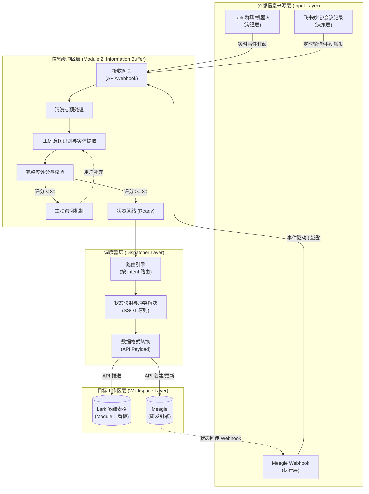

# AI Management 项目看板信息源体系总纲

**作者**: Manus AI
**日期**: 2026-04-08
**关联任务**: tsk-2beb54e9-462 (调研), tsk-41c824dc-a53 (规划)

---

## 1. 体系概述

为解决 AI Management 项目看板（Kanban）数据依赖人工录入、信息断层及多任务混杂等痛点，本体系构建了**"多源采集 → 统一缓冲 → 智能路由 → 看板渲染"**的端到端自动化架构。

通过打通"沟通层（Lark） + 决策层（会议转录） + 执行层（Meegle）"的立体信息源矩阵，AI 秘书将具备全方位的项目感知能力，真正实现看板的自动化、智能化运转。

---

## 2. 核心接入架构

系统整体分为四个核心层级，每层职责清晰、边界明确。各信息来源通过不同的触发机制进入信息缓冲区（Buffer），经过 LLM 的意图识别、实体提取与完整度评分后，状态变更为 `ready` 的信息条目将被调度器推送至 Lark 看板或 Meegle 工作区。

### 2.1 架构分层设计

| 层级 | 核心职责 | 关键组件 |
| :--- | :--- | :--- |
| **入口层** (Input Layer) | 多渠道信息接收，统一推送至缓冲区网关 | Lark Bot、Meegle Webhook |
| **缓冲层** (Buffer Layer) | 信息清洗、意图识别、完整度评分、状态管理 | LLM 引擎、状态机（pending/asking/ready）、主动询问机制 |
| **调度层** (Dispatcher Layer) | 路由决策、状态映射、格式转换、幂等性检查 | 路由引擎、SSOT 冲突解决器、API Payload 构建器 |
| **工作区层** (Workspace Layer) | 最终数据落地，提供可视化看板 | Lark 多维表格（Module 1）、Meegle |

### 2.2 架构数据流图

---

## 3. 信息来源接入优先级与规格

基于「价值/实施成本」比值，系统推荐以下优先级排序，并提供核心来源的详细接入规格。

### 3.1 接入优先级排序

1. **Meegle 工作项状态** (价值：极高 | 成本：低) - 研发事实的唯一来源。
2. **Lark 群聊/机器人** (价值：极高 | 成本：高) - 项目沟通主阵地，信息量最大。
3. **飞书妙记/会议记录** (价值：高 | 成本：高) - 决策层核心信息。
4. **Lark 审批流/表单** (价值：中 | 成本：中) - 结构化业务流程的接入。
5. **GitHub Issues/PRs** (价值：中 | 成本：低) - 代码层辅助参考，非主要驱动源。

### 3.2 核心来源接入规格

#### 来源一：Meegle 工作项状态变更（P0）
*   **定位**：研发状态的 Single Source of Truth。
*   **触发机制**：事件驱动（Meegle Webhook `story.updated` 等）。
*   **数据映射**：`status.name` → `状态`；`assignee.key` → `负责人`。
*   **完整度评分**：默认 100 分，直接标记为 `ready`，跳过 LLM 分析。

#### 来源二：Lark 群聊/机器人（P0）
*   **定位**：包含大量隐性知识与临时决策的非结构化来源。
*   **触发机制**：实时事件推送（`im.message.receive_v1`），支持 `@AI秘书` 触发。
*   **数据映射**：LLM 提取 `module_name`、`feature_name`、`intent_type`。
*   **完整度评分**：基础分 40 + 模块匹配 30 + 关键要素 30。评分 < 80 时，机器人在群内追问。

#### 来源三：飞书妙记/会议记录（P1）
*   **定位**：项目决策与 Action Items 的核心来源。
*   **触发机制**：定时轮询或 PM 手动触发（`/process_meeting`）。
*   **数据映射**：LLM 提取 `action_item`、`owner`、`deadline`。
*   **完整度评分**：明确动作 +40，明确责任人 +30，明确时间点 +30。所有提取条目默认进入"待确认"队列。

#### 来源四：GitHub Issues/PRs（参考级，非主驱动）
*   **定位**：代码层面的辅助参考，不作为看板状态的主要驱动来源。
*   **说明**：GitHub 的 PR 合并和 Issue 状态可作为 Meegle 状态的补充核验依据，但不单独驱动看板状态流转。如需接入，通过 Webhook 监听 `pull_request.closed` 事件，将信息推入缓冲区供人工确认后处理。

---

## 4. 实施路线图与集成方案

### 4.1 分阶段实施路线图

*   **第一阶段：Quick Win（第 1-2 周）**
    *   目标：接入成本低、价值高的结构化数据。
    *   重点：Meegle Webhook 接入与状态回传验证。
*   **第二阶段：核心建设（第 3-4 周）**
    *   目标：接入高频沟通场景，引入 LLM 智能拆分。
    *   重点：Lark 群聊机器人监控、多对话分离算法上线。
*   **第三阶段：长期规划（第 5-8 周）**
    *   目标：多模态数据源深度洞察与预警。
    *   重点：飞书妙记会议记录自动提取、Lark 审批流接入、全局里程碑动态预警。

### 4.2 模块双向集成 (SSOT 原则)

Meegle 与 Lark 看板之间的双向同步遵循 **Single Source of Truth（SSOT）** 原则：
1.  **Lark → Meegle（推送方向）**：当 Lark 看板中功能状态变更为"开发中"时，调度器调用 Meegle API 创建对应的 Story/Task，并将 Meegle ID 回写至 Lark。
2.  **Meegle → Lark（回传方向）**：当 Meegle 工作项状态变更时，通过 Webhook 回传至缓冲区，直接标记为 `ready` 并更新 Lark 看板状态。
3.  **冲突解决**：进入开发前（无 Meegle ID），以 Lark 为主；进入开发后（存在 Meegle ID），以 Meegle 为主。

---

## 5. 风险与应对

| 风险点 | 应对措施 |
| :--- | :--- |
| **LLM 幻觉与意图误判** | 强制完整度评分机制；关键状态变更依赖物理事实数据；优化 Prompt 与 Few-shot 示例。 |
| **多源数据并发冲突** | 引入分布式锁（如 Redis）；实现幂等性检查，防止重复写入。 |
| **身份映射失败** | 建立统一的"Lark-Meegle" ID 映射表；失败时分配给默认账号并通知 PM 手动关联。 |
| **防堆积与信息过载** | 严格执行缓冲区防堆积策略：24 小时未处理降级，72 小时强制归档。 |
