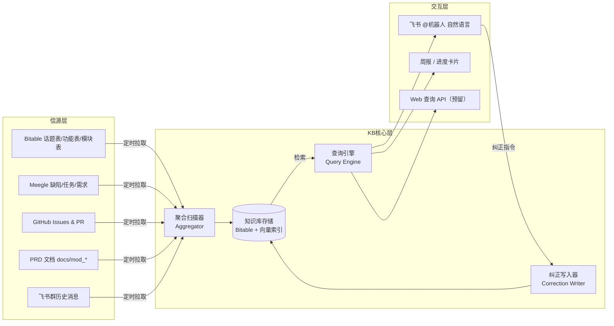
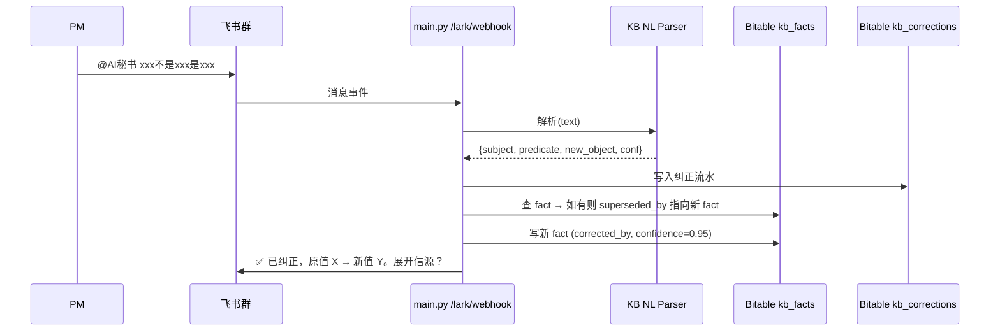

# 模块四：项目知识库 (Project Knowledge Base) — 总体设计

**状态**：设计中（架构稿 v0.1）
**作者**：Manus AI
**日期**：2026-05-07
**关联分支**：`claude/knowledge-base-system-jmztX`
**关联模块**：`module2_buffer`（事实沉淀源）、`module3_info_sources`（信息采集源）、`module1_kanban`（数据展示）

---

## 1. 模块定位

知识库（Knowledge Base，下称 **KB**）是 AI 秘书系统对项目的**长期事实记忆层**。它不直接接收原始消息，也不负责派发动作，而是站在缓冲区（Module 2）与看板（Module 1）之上，回答两类核心问题：

1. **「项目现在到底怎么样了？」** —— 跨模块、跨信源聚合出可信的项目认知。
2. **「这个结论是怎么来的？」** —— 每一条事实都能展开到原始信源（消息、Bitable 行、Meegle 工作项、PRD 段落）。

> KB 与 Buffer 的本质区别：
> - **Buffer** 处理的是**短期事件**（碎片信息 → 派发或归档），生命周期以「天」计。
> - **KB** 处理的是**长期事实**（项目认知图谱），生命周期以「项目」计。

## 2. 三大刚性需求（来自 PM 原话）

| 需求 | 描述 | 系统响应 |
|---|---|---|
| **R1: 实时纠正认知** | PM 看到错误结论时，能立刻在飞书里 @机器人 说"这个不对，实际是 …" | KB 必须支持原地覆写并保留版本，纠正生效 ≤ 30 秒 |
| **R2: 主动获取信息** | KB 不能只被动等 PM 投喂；要能定时扫描各信源，自己拼出项目状态 | 调度器每日聚合 Bitable / Meegle / GitHub / PRD，识别冲突主动追问 |
| **R3: 信源标注 + 内容展示** | 任何回答都必须给出**信源类型 + 信源 ID + 信源内容片段**，不能只给结论 | 所有 KB 回答模板强制带 `[信源]` 区块；点击可跳转 Bitable / 群消息 |

> 这三条是 KB 的**红线需求**。任何 PR 或 Agent 工作如果违背任一条，必须被驳回。

## 3. 架构总览

### 3.1 分层



### 3.2 核心组件清单

| 组件 | 文件（计划）| 职责 |
|---|---|---|
| **Aggregator** | `scripts/kb_aggregator.py` | 定时多源扫描，构建/刷新 KB 事实条目，识别跨源冲突 |
| **Knowledge Store** | Bitable 新增三表 + `data/kb_vector.faiss` | 事实条目持久化 + 向量化检索 |
| **Correction Writer** | `scripts/kb_correction_writer.py`（基于现有 `correction_writer.py` 扩展） | 处理来自 @机器人 的自然语言纠正，写入并打 `corrected_by` 标签 |
| **Query Engine** | `scripts/kb_query_engine.py` | 自然语言 Q → 向量检索 + 结构化过滤 → 带信源的回答 |
| **NL Correction Parser** | `scripts/kb_nl_correction_parser.py` | LLM 解析自然语言纠正语句（话题 / 字段 / 新值 / 信心分） |
| **Webhook Hook** | 扩展 `main.py` `/lark/webhook` | 在现有 QA / Correction 路由前增加 KB 路由 |

## 4. 数据模型（核心三张表）

完整字段说明见 [`data_model.md`](./data_model.md)，此处给概览。

### 4.1 `kb_facts`（事实表）

KB 的**主存储**。每条记录是一条带信源的项目事实。

| 字段 | 类型 | 说明 |
|---|---|---|
| `fact_id` | String | KB 内部 ID（`kb-fact-YYYYMMDD-NNNN`）|
| `subject` | String | 主语：模块名 / 话题 / 功能 / 人名 |
| `predicate` | String | 谓语：状态 / 进度 / 决策 / 风险 / 负责人 |
| `object` | Text | 宾语（事实内容）|
| `confidence` | Float | 置信度 0.0~1.0（多源一致 = 1.0，单源 = 0.7，纠正过 = 0.95）|
| `source_refs` | JSON Array | **信源数组**（见 4.2，多源时多条）|
| `valid_from` | DateTime | 事实生效起始时间 |
| `superseded_by` | String\|null | 被哪条 fact 覆盖（纠正历史链）|
| `corrected_by` | String\|null | 纠正人 open_id（仅纠正路径有值）|
| `created_at` / `updated_at` | DateTime | 标准时间戳 |

### 4.2 `kb_sources`（信源表）

每条事实可关联 1~N 条信源。**信源即"凭证"**。

| 字段 | 类型 | 说明 |
|---|---|---|
| `source_id` | String | KB 内部 ID（`kb-src-YYYYMMDD-NNNN`）|
| `source_type` | Enum | `bitable_row` / `meegle_workitem` / `github_issue` / `prd_section` / `lark_message` / `human_correction` |
| `source_locator` | JSON | **可定位回去的元数据**（见下表 4.2.1）|
| `source_excerpt` | Text | **原文片段**（必填，≤500 字，回答时直接展示给 PM）|
| `captured_at` | DateTime | 抓取时间 |
| `url` | String\|null | 可点击跳转的 URL（Bitable 行链接 / Meegle 链接 / GitHub URL）|

#### 4.2.1 `source_locator` 结构示例

```json
// Bitable 行
{"app_token": "Cyxxxxx", "table_id": "tblxxxxx", "record_id": "recxxxxx"}
// Meegle 工作项
{"project_key": "xpbet", "work_item_id": 12345, "type": "story"}
// 飞书群消息
{"chat_id": "oc_xxxxx", "message_id": "om_xxxxx", "sender_open_id": "ou_xxxxx"}
// PRD 文档段落
{"file_path": "docs/mod_casino/PRD_xxx.md", "section_anchor": "@feature_001", "line_range": "120-145"}
// 人工纠正
{"corrector_open_id": "ou_xxxxx", "correction_log_id": "kb-corr-xxxxx"}
```

### 4.3 `kb_corrections`（纠正日志表）

纠正动作的**审计流水**。任何对 `kb_facts` 的覆写必须先在此落账。

| 字段 | 类型 | 说明 |
|---|---|---|
| `correction_id` | String | `kb-corr-YYYYMMDD-NNNN` |
| `target_fact_id` | String | 被纠正的事实 ID（若为新增则为空，新增 fact 后回填）|
| `corrector_open_id` | String | 飞书 open_id |
| `corrector_name` | String | 飞书显示名（冗余字段，便于人读）|
| `raw_message` | Text | 飞书原话 |
| `parsed_intent` | JSON | LLM 解析结果（`{subject, predicate, new_object, confidence}`）|
| `applied` | Bool | 是否成功落库 |
| `created_at` | DateTime | |

> 设计要点：纠正**永远不删旧记录**，只通过 `superseded_by` 链接形成历史链。这样 PM 想回看"上周三我们当时认为的状态是什么"也能回放。

## 5. 信源溯源（Source Attribution）展示规约

这是 R3 的强制实现。**所有** KB 输出（飞书回复、周报片段、API 响应）必须遵守：

### 5.1 强制三段式输出

```
【结论】<simply stated answer>

【信源】（共 N 条）
[1] type=bitable_row | captured 2026-05-06 09:12 | confidence 0.95
    excerpt: "支付系统：iOS 微信支付路由问题已经修复并通过回归"
    url: https://xxx.feishu.cn/base/Cyxxx?table=tblxxx&view=...

[2] type=meegle_workitem | captured 2026-05-06 14:30
    excerpt: "工作项 #12345 状态变更为 已完成 by 张三"
    url: https://meegle.example/projects/xpbet/items/12345

【置信度】0.92（多源一致）
```

### 5.2 禁止行为

- ❌ 任何回答出现"根据我了解 / 据我所知 / 项目应该是 …"等无信源措辞
- ❌ 信源仅给 ID 不给 excerpt 的回答（PM 不需要再翻一次）
- ❌ 把 LLM 的推断包装成事实而不标记 `confidence`

详细模板见 [`source_attribution_spec.md`](./source_attribution_spec.md)。

## 6. 主动获取（Active Aggregation）流程

详见 [`active_aggregation.md`](./active_aggregation.md)。核心是定时扫描 + 冲突识别：

```
每日 08:30  ─┬─> 扫描 Bitable 全表（话题/功能/模块/Meegle 镜像 6 张）
             ├─> 拉取 Meegle 增量（自上次扫描以来变更的工作项）
             ├─> 拉取 GitHub Issues 增量
             └─> 索引新增/修改的 PRD 段落（git diff）
                       │
                       ▼
              事实抽取 LLM（每条记录 → 1~N 个 fact 候选）
                       │
                       ▼
              与现有 kb_facts 对齐（subject + predicate 匹配）
                       │
                       ├─ 一致 → confidence +0.1（封顶 1.0）
                       ├─ 冲突 → 创建 kb_conflicts 条目，飞书追问 PM
                       └─ 新事实 → 直接落库，confidence = 0.7
```

## 7. 实时纠正（Real-time Correction）流程

详见 [`correction_flow.md`](./correction_flow.md)。

### 7.1 PM 输入示例（自然语言，不需要严格格式）

```
@AI秘书 支付系统不是已修复，iOS还有问题
@AI秘书 CRM 选型不是 Optimove 是 Smartico
@AI秘书 把"用户系统"的负责人改成李四
```

### 7.2 处理链路



### 7.3 权限

仅白名单用户（`KB_AUTHORIZED_USERS`，open_id 列表）能纠正。其它用户的 @ 只触发查询不触发写入。

## 8. 与现有系统的关系

| 现有组件 | KB 关系 | 改造点 |
|---|---|---|
| `scripts/correction_writer.py` | KB Correction Writer 的祖先 | 抽取 `_get_token` / `_fetch_records` 为公共工具，KB 复用但加 `source_refs` 字段 |
| `scripts/lark_qa_handler.py` | KB Query Engine 的前身 | 在 LLM Prompt 中强制要求"必须列信源"；返回模板替换为 5.1 的三段式 |
| `scripts/lark_correction_handler.py` | 现有 `纠正：xxx` 指令解析器 | 保留，KB 新增的自然语言路径作为**补充入口**；两条路径共享 `kb_corrections` 审计 |
| `main.py` `/lark/webhook` | 路由层 | 新增 `is_kb_query` / `is_kb_correction` 检测，优先级低于现有 QA / Correction，避免抢路由 |
| Bitable 现有六张表（话题/功能/模块/Meegle×3）| KB 的**信源**之一 | 不动；Aggregator 只读它们生成 kb_facts |
| `module2_buffer` | KB 的**上游** | Buffer 派发后的 ready 条目，Aggregator 应在 Bitable 落地时同步抽事实 |

> **关键决策**：KB 不替换上述任何模块，只是在它们之上"做一层有信源的事实账本"。物理存储复用 Bitable，避免双写复杂度。

## 9. 非功能要求

| 维度 | 指标 |
|---|---|
| 纠正生效延迟 | ≤ 30s（飞书消息到 Bitable 写入） |
| 主动扫描频率 | 默认每日 1 次（08:30 UTC+8），可配 `KB_AGGREGATE_CRON` |
| 单次回答信源数 | 1~5 条，多于 5 条折叠后 N-1 条为 `[更多 N-1 条]` |
| 向量索引规模 | < 10 万条事实，FAISS Flat 索引足够（< 100MB 内存）|
| 信源原文截断 | 单条 excerpt ≤ 500 字符，超长保留首尾 + `...` |

## 10. 分阶段交付

| 阶段 | 内容 | 文件 |
|---|---|---|
| **P1：架构定稿** | 本目录全部文档（本次交付） | `docs/module4_knowledge_base/*.md` |
| **P2：数据骨架** | 在 Bitable 创建 3 张新表（kb_facts / kb_sources / kb_corrections）；写 schema 校验脚本 | `scripts/kb_schema_init.py` |
| **P3：聚合器** | Aggregator 单源版（先 Bitable）→ 多源 | `scripts/kb_aggregator.py` |
| **P4：纠正闭环** | NL Parser + 纠正 webhook 路由 + 单元测试 | `scripts/kb_nl_correction_parser.py` + `main.py` 路由 |
| **P5：查询引擎** | 向量索引 + 三段式回答模板 + 缓存 | `scripts/kb_query_engine.py` |
| **P6：上线试运行** | 试运行 1 周，对比 Aggregator 自动事实与 PM 实际认知的吻合度 | 不出文件，看 `kb_corrections` 表的纠正频率 |

> 当前 PR 仅交付 P1（设计文档）。P2~P6 拆为后续 PR。

## 11. 已识别风险

| 风险 | 缓解 |
|---|---|
| LLM 把推断写成事实，污染 KB | 所有 Aggregator 写入路径必须给 `confidence ≤ 0.8`；置信度 1.0 仅留给"多源一致 + 人工确认"|
| 纠正频繁导致 fact 链过长 | `superseded_by` 链超过 5 跳触发清理：保留头尾，中间合并日志 |
| Bitable 表行数膨胀 | 设月度归档脚本，将 `valid_from` 早于 6 个月且未被引用的 fact 移到 `archive/kb_facts_YYYYMM` |
| 飞书自然语言纠正歧义 | NL Parser 对 `confidence < 0.6` 的解析结果**不直接落库**，改为反问 PM 二选一 |
| KB 与 Bitable 现有表数据漂移 | Aggregator 设"读 → 比对 → 不一致告警"模式，不静默修复 |

---

## 附：术语表

- **Fact**：KB 中的最小事实单元，主谓宾结构 + 信源 + 置信度
- **Source**：可定位、可展开的"凭证"，1 个 fact 关联 1~N 个 source
- **Confidence**：事实的可信度，由多源一致性 / 是否被纠正等因素决定
- **Supersession**：纠正后旧 fact 不删除，由 `superseded_by` 指向新 fact
- **Provenance**：信源溯源，KB 的核心承诺；任何回答都能"展开到原始信源"

下一步阅读：
- 数据模型细节 → [`data_model.md`](./data_model.md)
- 主动聚合细节 → [`active_aggregation.md`](./active_aggregation.md)
- 纠正交互细节 → [`correction_flow.md`](./correction_flow.md)
- 信源展示规约 → [`source_attribution_spec.md`](./source_attribution_spec.md)
- API 与 webhook 集成 → [`api_design.md`](./api_design.md)
- 完整生命周期图 → [`lifecycle_flow.md`](./lifecycle_flow.md)
