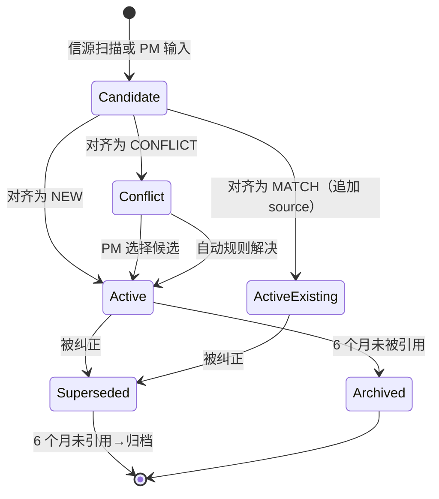
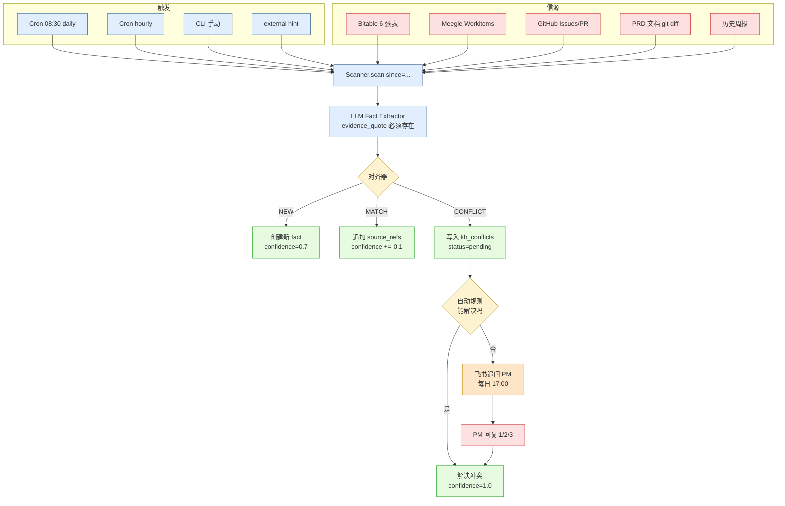
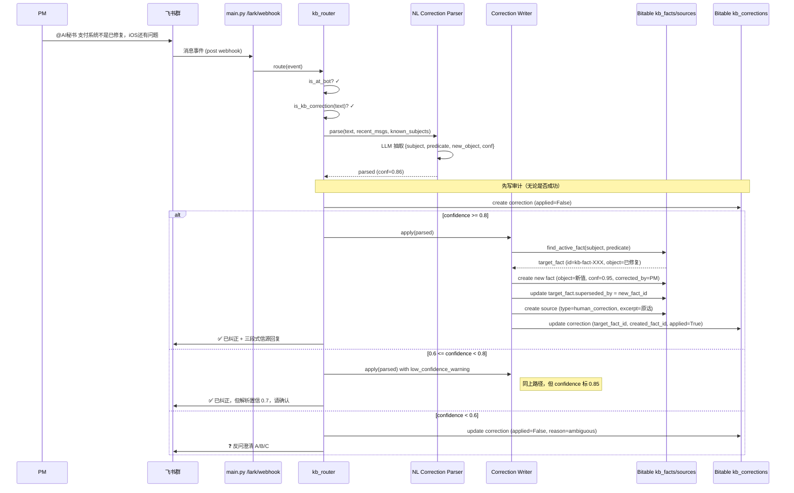
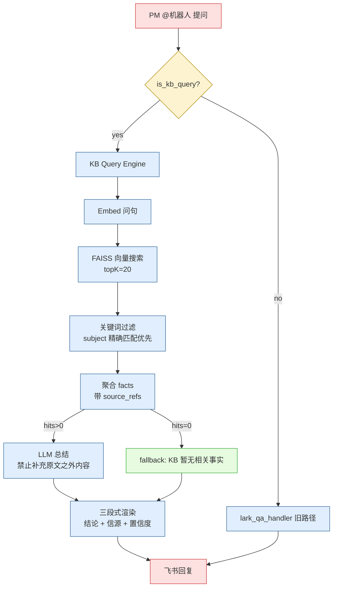
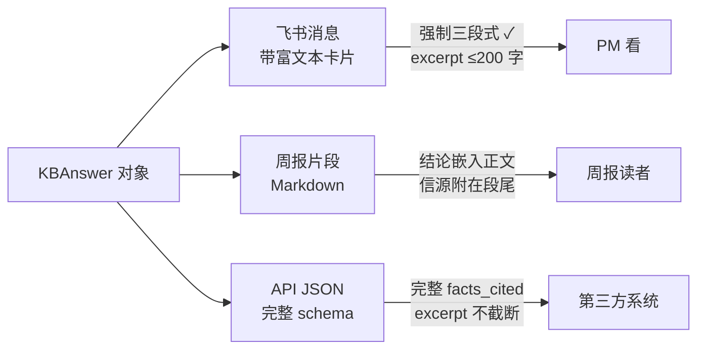
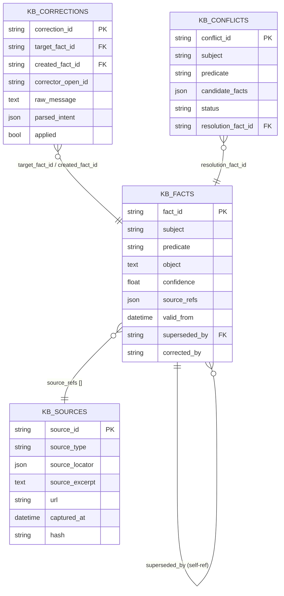
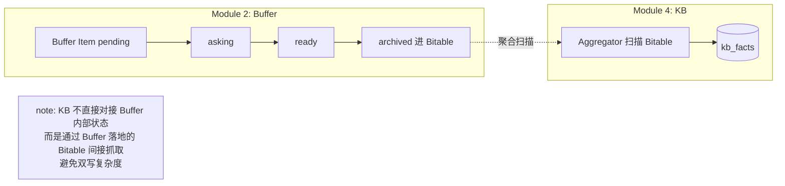

# KB 事实生命周期流程图

本图汇总主动聚合、纠正、查询三条主链路，覆盖 fact 从产生到归档的全过程。

## 1. 总览：Fact 生命周期状态机



## 2. 主动聚合扫描全链路



## 3. 实时纠正全链路



## 4. 查询全链路



## 5. 三种通道的输出对比



## 6. 表间关系（ER）



## 7. 关键时间节点

```
00:00 ─┬─ daily_progress_updater 跑（现有）
       │
08:30 ─┤  KB Aggregator daily run（新增）
       │   ├ 全量扫描 6 信源
       │   ├ 抽事实、对齐、写库
       │   └ 出冲突摘要
       │
每整点 ─┤  KB Aggregator hourly run（增量）
       │
17:00 ─┤  KB 冲突追问推送（pending 冲突 → PM）
       │
随时   ─┤  PM @机器人 查询 / 纠正
       │   └ 30 秒内生效
       │
周一06 ─┘  weekly_batch（现有）+ KB 周报集成
```

## 8. 与现有 module2 缓冲区的衔接


